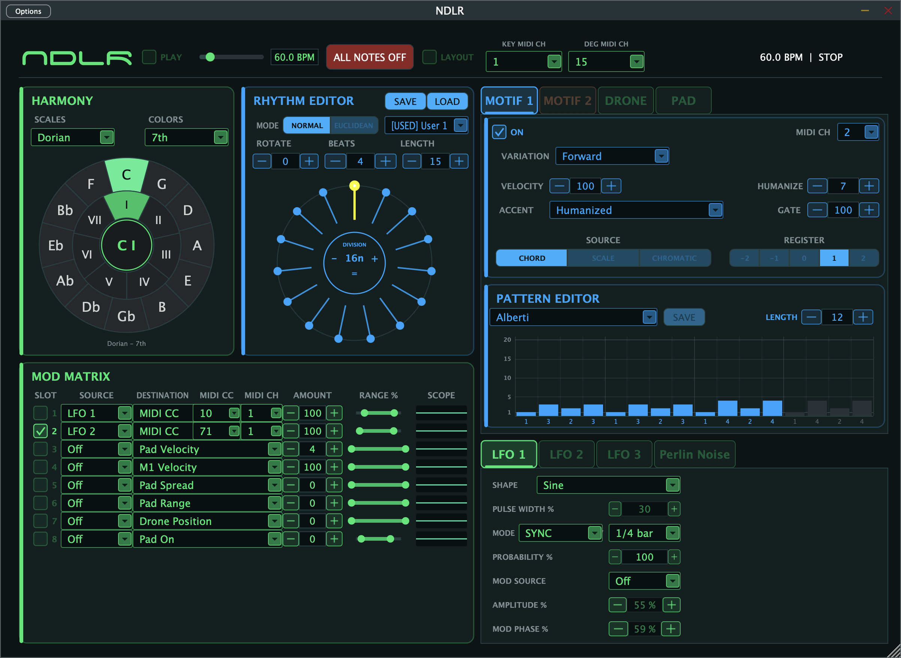

# NDLR JUCE

Portage progressif du projet NDLR Max vers JUCE.



## Télécharger

Les binaires macOS Universal 2 pour Apple Silicon et Intel (Standalone, Audio
Unit et VST3) sont disponibles dans la
[dernière release GitHub](https://github.com/emerge50/NDLR-JUCE/releases/latest).

## Configuration

- JUCE 8 dans `/Applications/JUCE`
- CMake 3.22 ou supérieur
- Xcode et les Command Line Tools
- VS Code avec C/C++ et CMake Tools

## Compiler

```sh
cmake -S . -B build -DJUCE_DIR=/Applications/JUCE -DCMAKE_BUILD_TYPE=Debug
cmake --build build --config Debug -j 4
ctest --test-dir build --output-on-failure -C Debug
```

Les cibles produites sont l'application autonome, l'Audio Unit et le VST3.

L'architecture macOS native est utilisée par défaut. Pour produire un binaire
universel, ajouter `-DCMAKE_OSX_ARCHITECTURES="arm64;x86_64"` à la configuration.
Les builds locaux sont signés ad hoc après génération des ressources ; utiliser
`-DNDLR_ADHOC_SIGN_BUNDLES=OFF` lorsqu'une signature de distribution est appliquée
par une étape dédiée.
